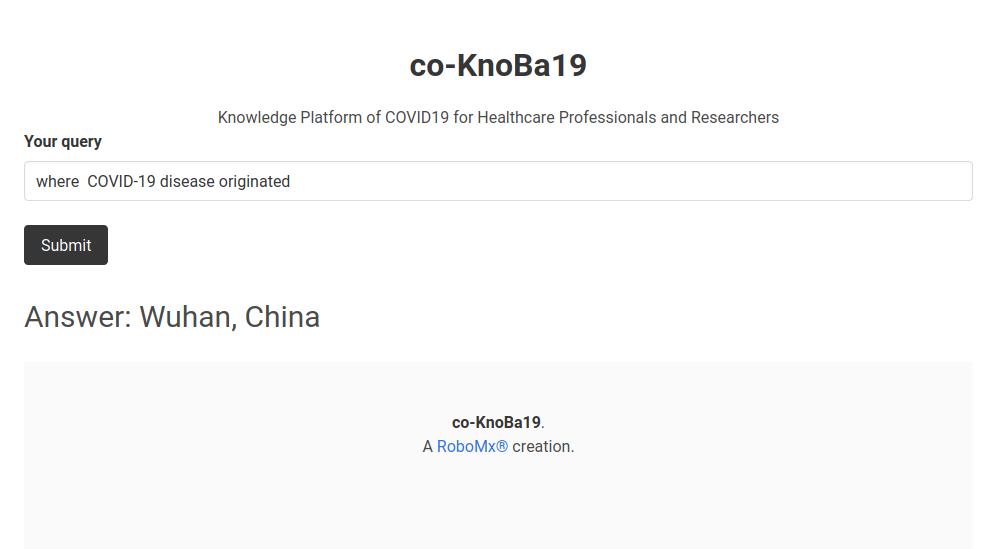

# `co-KnoBa19`

A knowledge platform of COVID-19

## Data Source
All content has been curated from referenced sources.
* [PubMed Central(PMC)](https://www.ncbi.nlm.nih.gov/pmc/?term=%22COVID-19%22+OR+Coronavirus+OR+%22Corona+virus%22+OR+%222019-nCoV%22+OR+%22SARS-CoV%22+OR+%22MERS-CoV%22+OR+%E2%80%9CSevere+Acute+Respiratory+Syndrome%E2%80%9D+OR+%E2%80%9CMiddle+East+Respiratory+Syndrome%E2%80%9D)
* [Wikipedia (data used for prototyping)](https://en.wikipedia.org/wiki/2019%E2%80%9320_coronavirus_pandemic)

## Demo

## Stack

This system uses BERT-based SQuAD model in DeepPavlov framework. The web application is developed using Flask Python framework and uses Bulma for UI components.

## Tasks
✅| QnA Session

⬜️| Multilingual support

⬜️| Scrap Data from Research Papers

⬜️| Use more NLP models

 
 
<h3 align="center">
    A RoboMx&reg; creation. 2020
</h3>